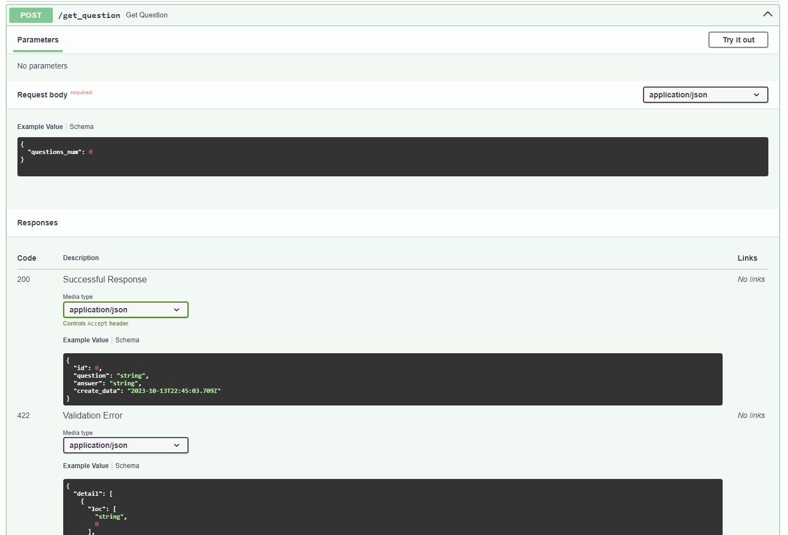

# Тестовое задание bewise


## Installation

Проект требует наличия [Docker](https://nodejs.org/) для запуска.

Собираем образ в папке с проектом и запускаем его:

```sh
docker-compose up
```

После окончания сборки и запуска проекта, в консоли должно появится следующее сообщение:

```sh
bewise_test_task-python-1   | INFO:     Started server process [1]
bewise_test_task-python-1   | INFO:     Waiting for application startup.
bewise_test_task-python-1   | INFO:     Application startup complete.
bewise_test_task-python-1   | INFO:     Uvicorn running on http://0.0.0.0:8002 (Press CTRL+C to quit)
```

## Доступ к API и postgreSQL


| Plugin | README |
| ------ | ------ |
| FastAPI Docs | http://localhost:8002/docs |
| PostgreSQL Adminer | http://localhost:8080/ |

Данные для доступа к PostgreSQL Adminer.
(Можно отредактировать в db_config.py)
| Поле | Значение |
| ------ | ------ |
| Движок | PostgreSQL |
| Сервер | db |
| Имя пользователя | bewiseuser |
| Пароль | bewisepassword |
| База данных | test_task |

## Instructions

Для отправки POST запроса в API есть 2 способа:

Через CMD:


```sh
curl -H "Content-Type: application/json" -X POST -d "{ \"questions_num\": 1 }" http://localhost:8002/get_question
```

Либо через сгенерированную документацию FastAPI:

```sh
http://localhost:8002/docs
```

